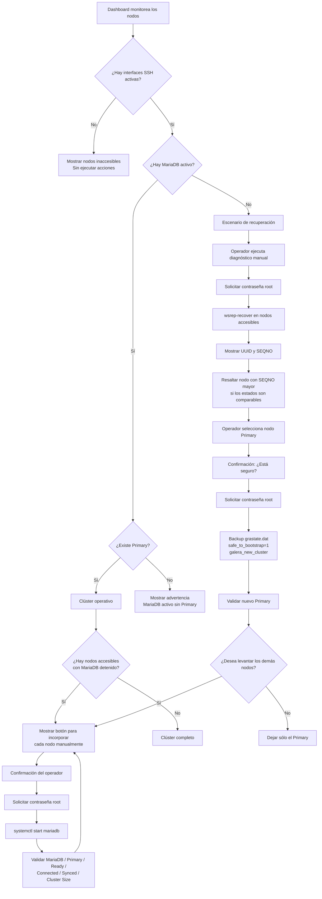

# FTS Galera Manager

## Objetivo

FTS Galera Manager permite **monitorear y operar manualmente** un clúster MariaDB Galera desde una sola interfaz web.

La aplicación nunca inicia, detiene, reinicia ni recupera nodos automáticamente. El monitoreo periódico es únicamente de lectura.

## Credenciales y control

- **Monitoreo:** `ftsuser` mediante llave SSH.
- **Consultas MariaDB/Galera:** se ejecutan remotamente por la sesión SSH utilizando `MYSQL_USER` y `MYSQL_PASSWORD` definidos en `.env`.
- **Acciones administrativas:** conexión SSH independiente como `root`.
- La contraseña de `root` se solicita **en cada operación** y no se almacena en `.env`, SQLite, auditoría ni sesión.

## Dashboard integrado

La recuperación ya no está separada del Dashboard. El mismo Dashboard determina cuál de los siguientes escenarios está presente.



## Caso 1: existe al menos un Primary

Si uno de los nodos tiene:

- interfaz SSH activa;
- MariaDB `active`;
- `wsrep_cluster_status = Primary`;

la aplicación permite incorporar los nodos accesibles que tengan MariaDB detenido.

Cada nodo se incorpora **uno por uno**. Antes de ejecutar `systemctl start mariadb` aparece una confirmación y se solicita nuevamente la contraseña de root.

Después de iniciar el servicio, la aplicación vuelve a consultar:

- MariaDB;
- `wsrep_cluster_status`;
- `wsrep_ready`;
- `wsrep_connected`;
- `wsrep_local_state_comment`;
- `wsrep_cluster_size`.

La aplicación no interpreta un `systemctl start` exitoso como suficiente: muestra el estado Galera resultante.

## Caso 2: interfaces activas y todos los MariaDB detenidos

Cuando ningún nodo accesible tiene MariaDB activo, el Dashboard habilita el diagnóstico de recuperación.

### Con tres interfaces disponibles

Se ejecuta manualmente `wsrep-recover` en los tres nodos y se muestran UUID y SEQNO.

### Con dos interfaces disponibles

Se diagnostican únicamente las dos interfaces accesibles. El Dashboard advierte que el nodo inaccesible podría contener un estado diferente o más reciente.

### Con una sola interfaz disponible

Se permite diagnosticar y levantar únicamente ese nodo, mostrando una advertencia de que no existe información para compararlo con los demás.

## Selección del Primary

El nodo con el SEQNO mayor se resalta como **Más actualizado** cuando el valor es numérico y comparable.

La aplicación **no selecciona automáticamente** el nodo. El operador conserva la decisión final.

Si se detectan UUID diferentes, se muestra una advertencia explícita porque no es seguro decidir solamente por el SEQNO.

Para establecer un nodo como Primary se requiere:

1. Seleccionar el nodo.
2. Confirmar que realmente se desea dejar ese nodo como Primary.
3. Escribir `RECUPERAR`.
4. Ingresar nuevamente la contraseña de root.
5. La aplicación realiza backup de `grastate.dat`.
6. Cambia `safe_to_bootstrap` a `1`.
7. Ejecuta `galera_new_cluster`.
8. Valida el estado posterior.

## Después del bootstrap

Cuando el nuevo Primary queda validado, la aplicación pregunta si se desean levantar los demás nodos.

- **No:** el clúster queda únicamente con el Primary seleccionado.
- **Sí:** se muestran los nodos faltantes para incorporarlos manualmente uno por uno.

Cada incorporación vuelve a solicitar contraseña root y vuelve a validar el estado del servicio y de Galera.

## Operaciones que nunca son automáticas

FTS Galera Manager no ejecuta acciones correctivas automáticamente. Las únicas acciones operativas expuestas en la interfaz son:

```text
systemctl start mariadb        # incorporar un nodo faltante
wsrep-recover                  # diagnóstico manual
galera_new_cluster             # recuperación manual
modificación de grastate.dat   # sólo durante recuperación confirmada
cambio de safe_to_bootstrap    # sólo durante recuperación confirmada
```

No se exponen opciones para detener o reiniciar MariaDB desde el Dashboard. El único proceso periódico es el monitoreo de solo lectura.

## Colores

El diseño general del Dashboard utiliza rojo como color institucional de la aplicación. Los indicadores verdes se reservan para estados saludables y los amarillos para advertencias operativas.
