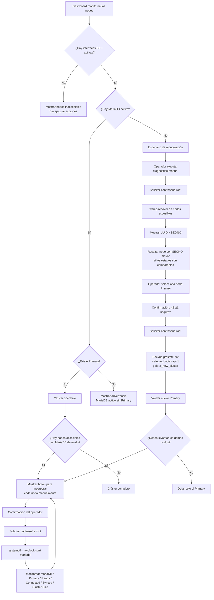

# FTS Galera Manager

## Objetivo

FTS Galera Manager permite **monitorear y operar manualmente** un clúster MariaDB Galera desde una sola interfaz web.

La aplicación nunca inicia, detiene, reinicia ni recupera nodos automáticamente. El monitoreo periódico es únicamente de lectura.

## Credenciales y control

- **Monitoreo:** `ftsuser` mediante `SSH_PASSWORD` o llave SSH. Cuando `SSH_PASSWORD` tiene valor, la contraseña tiene prioridad; si se deja vacío, se usa `SSH_KEY_PATH`.
- **Consultas MariaDB/Galera:** se ejecutan remotamente por la sesión SSH utilizando `MYSQL_USER` y `MYSQL_PASSWORD` definidos en `.env`.
- **Acciones administrativas:** conexión SSH independiente como `root`.
- La contraseña de `root` se solicita **en cada operación** y no se almacena en `.env`, SQLite, auditoría ni sesión.

Para autenticar el monitoreo por contraseña, configura y reinicia el contenedor:

```dotenv
SSH_USER=ftsuser
SSH_PASSWORD="tu-contraseña-ssh"
```

La contraseña SSH y la contraseña de MariaDB son credenciales diferentes. Por ejemplo:

```dotenv
SSH_USER=root
SSH_PASSWORD="contraseña-del-servidor"
MYSQL_USER=root
MYSQL_PASSWORD="contraseña-de-mariadb"
```

Si aparece `ERROR 1045 (28000): Access denied`, la conexión SSH ya funcionó y el rechazo proviene de MariaDB. Verifica `MYSQL_USER` y `MYSQL_PASSWORD`. Si el usuario `root` de MariaDB utiliza autenticación por socket local, puede requerir `MYSQL_PASSWORD=` vacío.

## Monitoreo periódico

El navegador controla las consultas periódicas mientras el Dashboard está abierto. Con esta configuración se consulta cada 10 segundos:

```dotenv
AUTO_MONITOR=true
MONITOR_INTERVAL=10
```

El intervalo mínimo admitido es de 5 segundos. Cada navegador abierto genera sus propias consultas y los nodos se inspeccionan uno por uno. Una nueva consulta no se inicia si la anterior todavía está en curso.

Para cada nodo se comprueba:

1. Accesibilidad del puerto SSH.
2. Estado de `systemctl is-active mariadb`.
3. Estado Galera mediante las variables `wsrep_*`, cuando MariaDB está activo.

Las respuestas actualizan solamente el resumen, las tarjetas, sus controles y el panel de recuperación. Las acciones del Dashboard tampoco recargan la página completa.

## Dashboard integrado

La recuperación ya no está separada del Dashboard. El mismo Dashboard determina cuál de los siguientes escenarios está presente.



## Caso 1: existe al menos un Primary

Si uno de los nodos tiene:

- interfaz SSH activa;
- MariaDB `active`;
- `wsrep_cluster_status = Primary`;

la aplicación permite incorporar los nodos accesibles que tengan MariaDB detenido.

Cada nodo se incorpora **uno por uno**. Antes de ejecutar `systemctl --no-block start mariadb.service` aparece una confirmación y se solicita nuevamente la contraseña de root.

El uso de `--no-block` es importante para bases grandes. systemd acepta la solicitud y libera inmediatamente la conexión web, mientras la transferencia IST o SST continúa en el servidor durante el tiempo necesario. Un SST de cientos de GB puede tardar varias horas y no queda limitado por el timeout de la petición SSH.

Después de iniciar el servicio, la aplicación vuelve a consultar:

- MariaDB;
- `wsrep_cluster_status`;
- `wsrep_ready`;
- `wsrep_connected`;
- `wsrep_local_state_comment`;
- `wsrep_cluster_size`.

La aplicación no interpreta la aceptación del comando como una sincronización terminada. La tarjeta permanece en **Sincronizando** hasta confirmar simultáneamente:

- MariaDB `active`;
- `wsrep_local_state_comment = Synced`;
- `wsrep_ready = ON`;
- `wsrep_connected = ON`.

También se reconoce como sincronización cuando systemd informa `activating` o `reloading`, cuando Galera informa `Joining` o `Donor/Desynced`, y cuando MariaDB responde temporalmente con `ERROR 1047: WSREP has not yet prepared node for application use`.

Mientras el nodo está iniciando o sincronizando, su formulario de inicio queda bloqueado y el servidor rechaza intentos repetidos. Los flujos de diagnóstico y bootstrap tampoco consideran un nodo `activating` como detenido.

## Caso 2: interfaces activas y todos los MariaDB detenidos

Cuando ningún nodo accesible tiene MariaDB activo, el Dashboard habilita el diagnóstico de recuperación.

### Con tres interfaces disponibles

Se ejecuta manualmente `wsrep-recover` en los tres nodos y se muestran UUID y SEQNO.

### Con dos interfaces disponibles

Se diagnostican únicamente las dos interfaces accesibles. El Dashboard advierte que el nodo inaccesible podría contener un estado diferente o más reciente.

### Con una sola interfaz disponible

Se permite diagnosticar y levantar únicamente ese nodo, mostrando una advertencia de que no existe información para compararlo con los demás.

## Selección del Primary

El nodo con el SEQNO mayor se resalta como **Más actualizado** cuando el valor es numérico y comparable.

La aplicación **no selecciona automáticamente** el nodo. El operador conserva la decisión final.

Si se detectan UUID diferentes, se muestra una advertencia explícita porque no es seguro decidir solamente por el SEQNO.

Para establecer un nodo como Primary se requiere:

1. Seleccionar el nodo.
2. Confirmar que realmente se desea dejar ese nodo como Primary.
3. Escribir `RECUPERAR`.
4. Ingresar nuevamente la contraseña de root.
5. La aplicación realiza backup de `grastate.dat`.
6. Cambia `safe_to_bootstrap` a `1`.
7. Ejecuta `galera_new_cluster`.
8. Valida el estado posterior.

El backup queda en el mismo directorio configurado en `MYSQL_GRASTATE`, con fecha y hora agregadas al nombre. Por ejemplo:

```text
/var/lib/mysql/grastate.dat
/var/lib/mysql/grastate.dat.bak.2026-09-03_135928
```

## Después del bootstrap

Cuando el nuevo Primary queda validado, la aplicación pregunta si se desean levantar los demás nodos.

- **No:** el clúster queda únicamente con el Primary seleccionado.
- **Sí:** se muestran los nodos faltantes para incorporarlos manualmente uno por uno.

Cada incorporación vuelve a solicitar contraseña root y vuelve a validar el estado del servicio y de Galera.

## Operaciones que nunca son automáticas

FTS Galera Manager no ejecuta acciones correctivas automáticamente. Las únicas acciones operativas expuestas en la interfaz son:

```text
systemctl --no-block start mariadb.service # solicitar la incorporación
wsrep-recover                  # diagnóstico manual
galera_new_cluster             # recuperación manual
modificación de grastate.dat   # sólo durante recuperación confirmada
cambio de safe_to_bootstrap    # sólo durante recuperación confirmada
```

No se exponen opciones para detener o reiniciar MariaDB desde el Dashboard. El único proceso periódico es el monitoreo de solo lectura.

## Colores

El diseño general del Dashboard utiliza rojo como color institucional de la aplicación. Cada tarjeta muestra un punto y una leyenda:

- **Verde - Operativo:** SSH disponible y Galera en `Synced`, `Ready=ON` y `Connected=ON`.
- **Amarillo - Sincronizando:** MariaDB o Galera están iniciando, realizando IST/SST o todavía no alcanzan `Synced`.
- **Amarillo - MariaDB caído:** SSH está disponible, pero el servicio está detenido o falló.
- **Amarillo - Estado no disponible:** MariaDB está activo, pero no fue posible confirmar el estado Galera.
- **Rojo - Nodo desconectado:** no existe conectividad con el puerto SSH.

## Auditoría

Las operaciones manuales guardan fecha, actor, nodo, acción, resultado y detalle en SQLite. Las secuencias ANSI de color producidas por comandos remotos se eliminan antes de guardar registros nuevos y también al mostrar registros antiguos. La contraseña de root no se incluye en la auditoría.

## Aplicar cambios y resolver caché

Después de actualizar la aplicación, reconstruye y recrea el contenedor:

```bash
docker compose up -d --build
```

Si el navegador continúa ejecutando una versión anterior del JavaScript, utiliza `Ctrl+F5`. Errores como `Not Found` o `There was an error parsing the body` después de una actualización pueden indicar que el navegador conserva recursos anteriores; revisa primero que el contenedor se haya reconstruido y fuerza la recarga de caché.
